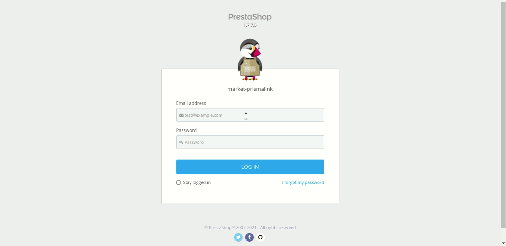
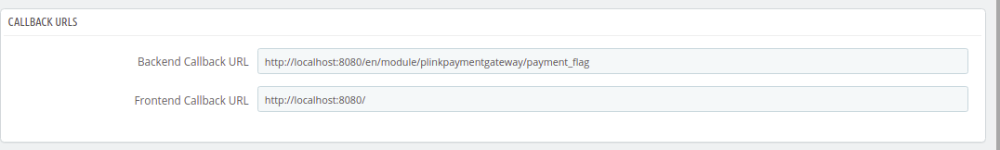

# plugin-prestashop

Requirements:

* Prestashop 1.7.x
* Php >= 7.1
* Currency code IDR

Integration:

1. Download the plugin file.
2. Go to **(Your dashboard sidebar) > Modules > Modules Manager** on PrestaShop administration page.
3. Click **Upload a module** .
4. Locate the **plinkpaymentgateway.zip** file, click **Open** .
   The plugin is installed successfully. A message to confirm the action is displayed.
5. Click **Configure**.
6. Find the **Plinkpaymentgateway** module in the module manager and click **Configure** . Configure *Plinkpaymentgateway* page is displayed. Follow the steps given below.

   * Enter **Merchant Code** .
   * Enter **Secret Key.**
   * Enter **Merchant Key ID** .
   * In the **Mode** list, click the appropriate environment.*Test* for testing transaction,*Live* for real transaction.
   * Select desired order status for successful payments, from **Payment Status - Success** list **(This is optional)**
   * Select desired order status for pending payments, from **Payment Status - Pending** list **(This is optional)**
   * Select desired order status for waiting payments, from **Payment Status - Waiting** list **(This is optional)**
   * Select desired order status for rejected payments, from **Payment Status - Rejected** list **(This is optional)**

7. To complete module integration you need to register your **backend callback flag url**  and **frontend callback flag url**. So the generated backend and frontend callback url on your administrator will be registered to plink.

   

**Payment flow**

