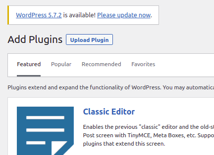
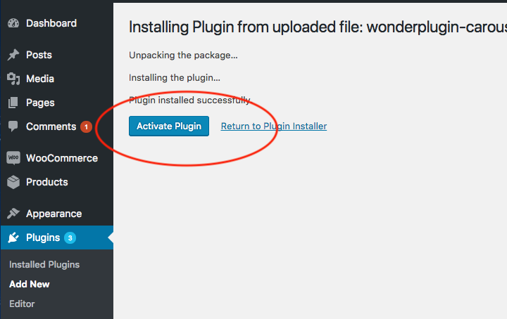
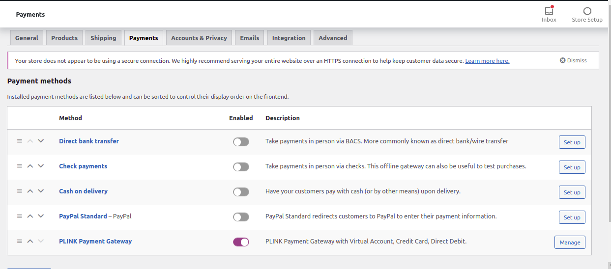
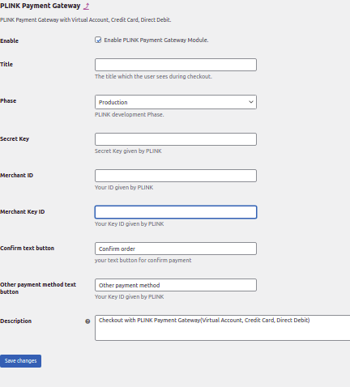
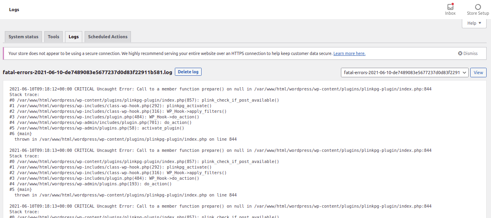
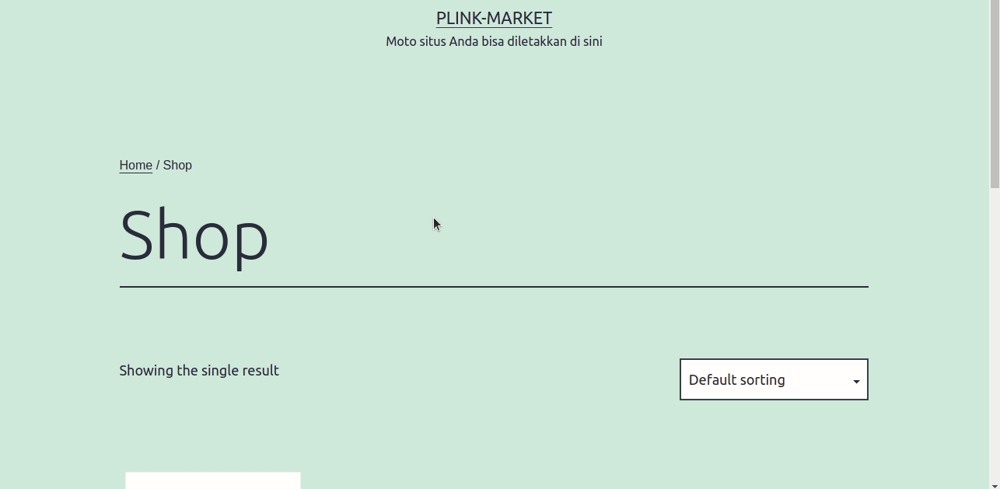

**PLINK woocommerce plugin**

**Enviroment**

- php 7.4.16
- Wordpress 5.7.2
- Woocommerce 5.1.10

**Instalation**

1. Zip this project or \*if this project is already in zipped you can skip to step 2
2. Goto wordpress dashboard
3. Goto Plugins on side menu > add new plugin > upload plugin by clicking to plugin upload

4. Activate plugin

5. After the plugin installed. Go to side menu > Woocommerce > Settings

6. On the list of Payment methods find and set PLINK Payment Gateway to enabled

7. Click Manage button  on plink payment gateway’s row

8. Then here are credentials and settings for the plugin to be inputtend

9. Input all requirements credential and set setting  then click save changes.

**Information**

`	`Enable			: To enable and disable PLINK payment gateway

`	`Title			: Title for payment PLINK payment gateway

`	`Phase			: Change payment mode to staging or production

`				  `staging = mode for testing, it means no real transaction made

`				  `production =  mode real transaction

`	`Secret key		: Credential given by PLINK when you register as merchant

`	`Merchant ID		: Credential given by PLINK when you register as merchant

`	`Merchant key ID	: Credential given by PLINK when you register as merchant

`	`Confirm text button	: Confirm text button after checkout to PLINK page

`	`Other payment method text button	: Other payment method text button after checkout to

`  `PLINK page

`	`Description	: Payment description in list payment page

## Logging

Go to woocommerce on side menu-> status -> logging

### Payment Flow

## License

[MIT](https://choosealicense.com/licenses/mit/)
